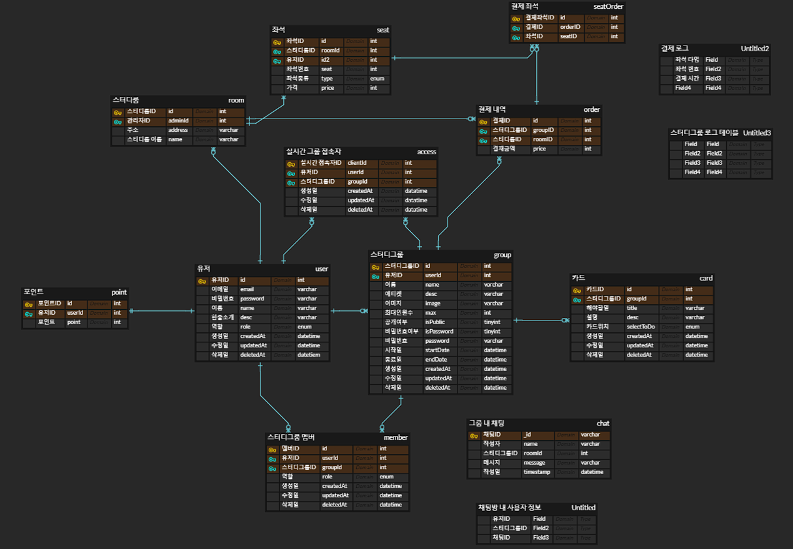

# AppleTree

### 프로젝트 명칭

# 사과나무

### 팀원 소개

| 이름   | Blog                         | Github                          |
| ------ | ---------------------------- | ------------------------------- |
| 장시훈 | https://velog.io/@sh_j225    | https://github.com/sihunjang225 |
| 배찬용 | https://baecy341.tistory.com | https://github.com/baechanyong1 |
| 김태진 | https://qpdbdbqp.tistory.com | https://github.com/ktj0         |

## 프로젝트 목적과 기능

**프로젝트 목적:**

이 프로젝트의 목적은 온라인 스터디그룹 관리와 오프라인 스터디를 위한 스터디룸 예약 시스템을 개발하여 사용자들에게 효율적인 스터디 환경을 제공하는 것입니다. 이를 통해 온라인 및 오프라인 스터디를 지원하고, 사용자들이 원활하게 스터디를 진행하고 관리할 수 있도록 합니다.

**주요 기능:**

1. **온라인 스터디그룹 관리:**
   - 사용자 등록 및 프로필 관리: 사용자들이 회원으로 가입하고 프로필을 설정할 수 있습니다.
   - 그룹 생성 및 가입: 사용자들은 특정 주제나 관심사를 기반으로 그룹을 생성하거나 가입할 수 있습니다.
   - 커뮤니케이션 기능: 그룹 내에서 실시간 채팅, 화상채팅 ,TODOLIST 공유 등을 통해 멤버들 간의 소통이 가능합니다.
   - 스케줄 관리: 그룹의 모임 일정을 등록하고 공유하여 참여 멤버들이 일정을 파악하고 참석할 수 있습니다.
2. **오프라인 스터디룸 예약 시스템:**
   - 스터디룸 예약: 사용자들은 특정 날짜와 시간에 스터디룸을 예약할 수 있습니다.
   - 예약 가능 여부 확인: 사용자들은 실시간으로 스터디룸의 예약 가능 여부를 확인하고, 이미 예약된 시간대를 파악할 수 있습니다.
   - 예약 상세 정보: 예약한 스터디룸의 위치, 시간, 인원 등의 상세 정보를 확인할 수 있습니다.
   - 알림 기능: 예약한 시간이 가까워지면 알림을 받을 수 있어 예약을 놓치지 않도록 돕습니다.

## Service Architecture

### 중요로직

1. **로그 데이터 관리**
   - 스터디룸 예약 시스템에서 주문 정보와 채팅방의 유저 활동은 중요한 데이터로 판단.
   - 회사 및 유저에게 필요한 데이터를 보존하기 위해 로그 데이터를 별도의 공간에 저장 결정.
   - 로그 데이터의 지속적인 DB 저장으로 서버 리소스 부담을 최소화하기 위해, 로그 데이터를 분기별로 저장하기로 결정.
   - 선택한 로그 데이터 관리 방식: 로그 파일 생성 후 분기별로 저장 계획, 아직 DB에 저장은 진행하지 못함.
2. **API 요청 및 로그 데이터 관리**
   - Winston 라이브러리 사용: 로그 데이터가 필요한 API 요청 시, 지속적으로 DB에 저장하면 서버 리소스 과다 사용 가능성으로 판단하여 Winston 라이브러리 선택.
3. **실시간 채팅 관리**
   - 캐시 메모리 활용: 실시간 채팅 기능에서 DB 저장 요청이 많을 경우 서버 리소스 과부하 예방을 위해, 캐시 메모리 활용 결정.
4. **유저 인증 및 인가 처리**
   - Guard 활용: 유저의 인증 및 인가 처리에 Guard를 활용한 일괄 처리 방식 선택.
   - Guard를 활용하여 로직을 일괄적으로 처리하며, 보안 및 인가 관련 로직 구현 방향으로 개발 시작.

### ERD

## 트러블슈팅

**로그 데이터 관리:**

- **도입 이유:** 채팅방 욕설, 결제 기록과 같은 중요 데이터 보존과 잠재적인 경고 시스템 및 빅데이터 활용을 고려함.
- **문제 상황:** 어떻게 로그를 저장하고 API 데이터를 DB에 저장할 것인가?
- **해결 방안:**
  1. API 요청 시 데이터를 직접 DB에 저장: 실시간 저장으로 서버 리소스 과부하 우려.
  2. Winston 라이브러리를 활용하여 로그 파일에 저장 후 분기별로 DB에 저장: 서버 리소스 절약, 로그 보는 UI 제공.
- **의견 조율:** 2번 방식 선택. Winston 라이브러리와 로그 파일 활용으로 서버 부담 줄임.

**실시간 채팅 데이터 관리:**

- **도입 이유:** 실시간 채팅에서 데이터 양이 많아 DB에 매번 저장은 서버에 부담.
- **문제 상황:** 실시간 채팅 메시지를 어떻게 효율적으로 저장할 것인가?
- **해결 방안:**
  1. 시간 단위로 캐시 메모리에 저장: 서버 리소스 절약, 시간마다 DB에 저장.
  2. 메시지 단위로 캐시 메모리에 저장: 메시지량 많을 경우 서버 리소스 과부하.
- **의견 조율:** 1번 방식 선택. 시간 단위로 캐시 메모리에 저장하고 스케줄러를 활용해 DB에 저장. 데이터 양 증가 시 시간 단위 변경 가능.

**유저 인증 및 인가 처리:**

- **도입 이유:** 스터디 그룹 내에서 유저 인증 및 인가 필요.
- **문제 상황:** 모든 유저가 스터디 그룹에서 작업 가능.
- **해결 방안:**
  1. API마다 조건문 추가하여 개별적으로 처리: 개발 시간 증가.
  2. Guard를 활용하여 일괄적으로 관리: 개발 시간 감소.
- **의견 조율:** 2번 방식 선택. Guard와 roles.guard를 활용하여 일괄적으로 유저 인증 및 인가 처리.

**[ Commit Message Convention ]**

      `feat` : 새로운 기능 추가 (Add …)
      `fix` : 코드 수정 (Change, Delete …)
      `docs` : 문서 수정 (README.md 등)
      `style` : 코드에 변경이 없는 단순 줄바꿈, 여백 수정
      `refactor` : 코드 리팩토링
      `test` : 테스트 코드 추가
      `chore` : 빌드 업무 수정, 패키지 매니저 수정

### API 명세

https://chanyongbae341s-organization.gitbook.io/untitled/reference/api-reference/api (사전 api 명세)

**[localhost:4444/api](http://localhost:4444/api) (배포 전 api명세 )**
