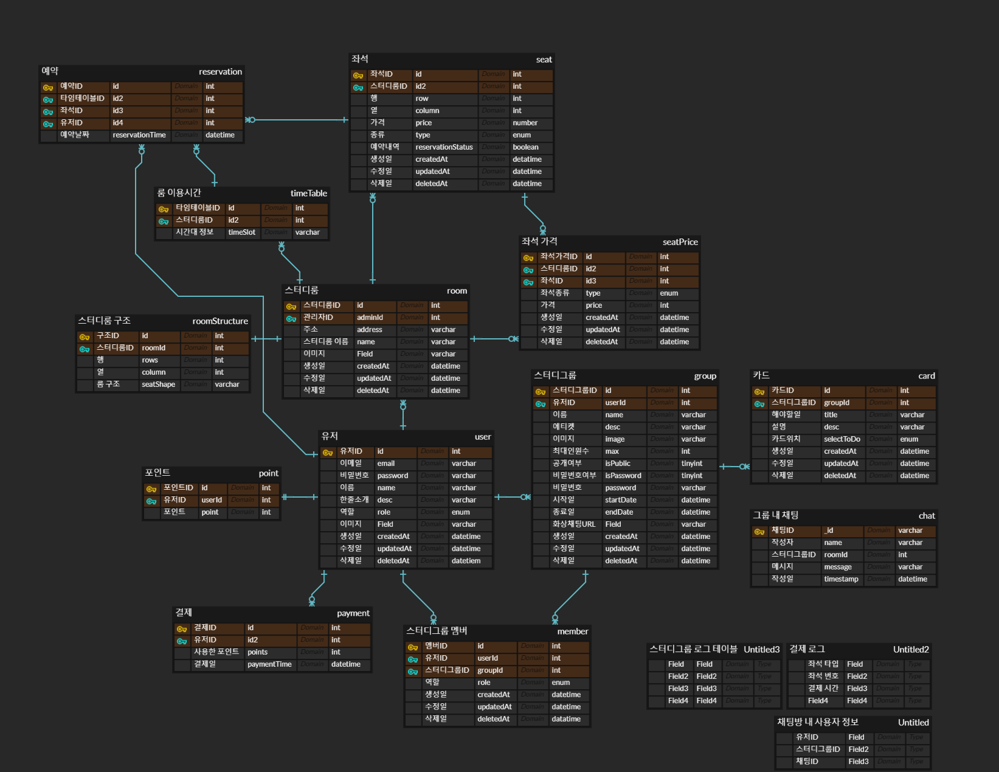

# AppleTree

### 프로젝트 명칭

사과나무

### 팀원 소개

| 이름   | Blog                                 | Github                          |
| ------ | ------------------------------------ | ------------------------------- |
| 장시훈 | https://velog.io/@sh_j225            | https://github.com/sihunjang225 |
| 배찬용 | https://baecy341.tistory.com         | https://github.com/baechanyong1 |
| 김태진 | https://qpdbdbqp.tistory.com         | https://github.com/ktj0         |
| 김재혁 | https://jh-healing-place.tistory.com | http://github.com/tuy112        |

### 프로젝트 목적과 기능

온라인 스터디그룹 관리와 오프라인 스터디를 위한 스터디룸 예약 시스템

### 중요로직

온라인 스터디그룹, 스터디룸 예약 시스템

### ERD

**[ Commit Message Convention ]**

      `feat` : 새로운 기능 추가 (Add …)
      `fix` : 코드 수정 (Change, Delete …)
      `docs` : 문서 수정 (README.md 등)
      `style` : 코드에 변경이 없는 단순 줄바꿈, 여백 수정
      `refactor` : 코드 리팩토링
      `test` : 테스트 코드 추가
      `chore` : 빌드 업무 수정, 패키지 매니저 수정
